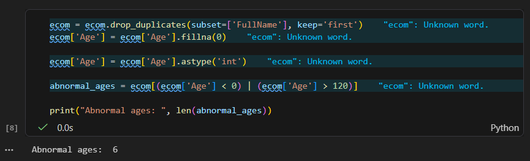

# E-commerce Company Dataset <br>
## Overview
I took upon myself as a student learning Data Science to generate fake E-commerce dataset for 500 random users and answer the various questions below. I introduced random mistakes in the dataset for data cleaning. This comes with the codes for performing various analysis and images of the results.

## Questions 
1. What is the total number of unique customers who have made at least one purchase? <br>
2. Are there any customers whose recorded age is negative or unrealistically high (> 100)? How many? <br>
3. What proportion of purchases have a PurchaseDate earlier than the RegistrationDate? <br>
4. Which state has the highest average TotalAmount per completed purchase? <br>
5. Identify the top 5 customers by total spending (sum of TotalAmount for Completed status only). <br>
6. How many purchases have mismatched TotalAmount compared to Price × Quantity? <br>
7. What is the refund rate (percentage of purchases with Status = Refunded)? <br>
8. Which category has the highest number of cancelled purchases? <br>
9. Which day of the week shows the highest number of purchases? <br>

## Setting up and Downloading various libraries
This is where i set up my IDE (Visual Studio code) by downloading all the extentions i will need (Had already installed Visual Studio Code). I then added my codebase to Github repository by using git and always committing changes often. <br><br>

*Image of setting up my environment*

### Tools used
* Python
* Visual studio code
* Jupyter Notebook
* Git
* Github

### Libraries
* Pandas
* Matplotlib
* Seaborn
* scikit-learn


###  Generating Random codes

```Python
import pandas as pd
import random
from datetime import datetime, timedelta
import numpy as np

# Lists for fake data
first_names = ['John', 'Jane', 'Alice', 'Bob', 'Charlie', 'David', 'Eve', 'Frank', 'Grace', 'Henry', 'Ivy', 'Jack', 'Katie', 'Leo', 'Mia', 'Noah', 'Olivia', 'Paul', 'Quinn', 'Ryan'] * 25
last_names = ['Smith', 'Doe', 'Johnson', 'Brown', 'Davis', 'Wilson', 'Moore', 'Taylor', 'Anderson', 'Thomas', 'Jackson', 'White', 'Harris', 'Martin', 'Thompson', 'Garcia', 'Martinez', 'Robinson', 'Clark', 'Rodriguez'] * 25
cities = ['New York', 'Los Angeles', 'Chicago', 'Houston', 'Phoenix', 'Philadelphia', 'San Antonio', 'San Diego', 'Dallas', 'San Jose', 'Austin', 'Jacksonville', 'Fort Worth', 'Columbus', 'Charlotte']
states = ['NY', 'CA', 'IL', 'TX', 'AZ', 'PA', 'TX', 'CA', 'TX', 'CA', 'TX', 'FL', 'TX', 'OH', 'NC']
countries = ['USA', 'Canada', 'UK', 'Germany', 'France']
genders = ['M', 'F', 'Other']
categories = ['Electronics', 'Clothing', 'Books', 'Home', 'Toys']
products = {
    'Electronics': ['Laptop', 'Smartphone', 'Headphones', 'Camera', 'Tablet'],
    'Clothing': ['Shirt', 'Pants', 'Dress', 'Jacket', 'Shoes'],
    'Books': ['Novel', 'Biography', 'Sci-Fi', 'Mystery', 'Textbook'],
    'Home': ['Lamp', 'Chair', 'Table', 'Bed', 'Sofa'],
    'Toys': ['Doll', 'Toy Car', 'Puzzle', 'Building Blocks', 'Board Game']
}
payment_methods = ['Credit Card', 'PayPal', 'Debit Card', 'Cash on Delivery', 'Bank Transfer']
statuses = ['Completed', 'Pending', 'Cancelled', 'Refunded']

# Generate users
users = []
for i in range(1, 501):
    fn = random.choice(first_names)
    ln = random.choice(last_names)
    username = f"{fn.lower()}_{ln.lower()}_{random.randint(1,999)}"
    email = f"{username}@example.com"
    address = f"{random.randint(100,9999)} Main St"
    city = random.choice(cities)
    state = random.choice(states)
    zipcode = f"{random.randint(10000,99999)}"
    country = random.choice(countries)
    reg_date = datetime(2020, 1, 1) + timedelta(days=random.randint(0, 1460))
    age = random.randint(18, 80)
    gender = random.choice(genders)
    phone = f"({random.randint(100,999)}){random.randint(100,999)}-{random.randint(1000,9999)}"
    users.append({
        'UserID': i,
        'Username': username,
        'FirstName': fn,
        'LastName': ln,
        'Email': email,
        'Address': address,
        'City': city,
        'State': state,
        'ZipCode': zipcode,
        'Country': country,
        'RegistrationDate': reg_date.strftime('%Y-%m-%d'),
        'Age': age,
        'Gender': gender,
        'Phone': phone
    })

# Generate purchases
rows = []
purchase_id = 1
for user in users:
    num_purchases = random.randint(0, 10)
    if num_purchases == 0:
        row = user.copy()
        row.update({
            'PurchaseID': np.nan,
            'ProductName': np.nan,
            'Category': np.nan,
            'Price': np.nan,
            'Quantity': np.nan,
            'TotalAmount': np.nan,
            'PurchaseDate': np.nan,
            'PaymentMethod': np.nan,
            'Status': np.nan
        })
        rows.append(row)
    else:
        for _ in range(num_purchases):
            cat = random.choice(categories)
            prod = random.choice(products[cat])
            price = round(random.uniform(5, 500), 2)
            qty = random.randint(1, 5)
            total = round(price * qty, 2)
            pur_date_dt = datetime.strptime(user['RegistrationDate'], '%Y-%m-%d') + timedelta(days=random.randint(1, 730))
            pur_date = pur_date_dt.strftime('%Y-%m-%d')
            pay = random.choice(payment_methods)
            stat = random.choice(statuses)
            row = user.copy()
            row.update({
                'PurchaseID': purchase_id,
                'ProductName': prod,
                'Category': cat,
                'Price': price,
                'Quantity': qty,
                'TotalAmount': total,
                'PurchaseDate': pur_date,
                'PaymentMethod': pay,
                'Status': stat
            })
            rows.append(row)
            purchase_id += 1

# Create DataFrame
df = pd.DataFrame(rows)

# Introduce mistakes (dirtiness)
for col in df.columns:
    if col not in ['UserID']:
        mask = [random.random() < 0.03 for _ in range(len(df))]
        df.loc[mask, col] = np.nan

# Typos in names
for i in range(len(df)):
    if random.random() < 0.05 and not pd.isna(df.loc[i, 'FirstName']):
        df.loc[i, 'FirstName'] += random.choice(['x', '!', '123', ' '])
    if random.random() < 0.05 and not pd.isna(df.loc[i, 'LastName']):
        df.loc[i, 'LastName'] += 'typo'

# Invalid emails
for i in range(len(df)):
    if random.random() < 0.03 and not pd.isna(df.loc[i, 'Email']):
        if random.random() < 0.5:
            df.loc[i, 'Email'] = df.loc[i, 'Email'].replace('@', '')
        else:
            df.loc[i, 'Email'] = 'invalid_email'

# Negative or unrealistic ages
for i in range(len(df)):
    if random.random() < 0.02 and not pd.isna(df.loc[i, 'Age']):
        if random.random() < 0.5:
            df.loc[i, 'Age'] = -int(df.loc[i, 'Age'])
        else:
            df.loc[i, 'Age'] = random.randint(100, 200)

# Invalid zip codes
for i in range(len(df)):
    if random.random() < 0.05 and not pd.isna(df.loc[i, 'ZipCode']):
        df.loc[i, 'ZipCode'] = str(random.randint(10, 999))

# Purchase dates before registration
for i in range(len(df)):
    if random.random() < 0.02 and not pd.isna(df.loc[i, 'PurchaseDate']) and not pd.isna(df.loc[i, 'RegistrationDate']):
        reg_dt = datetime.strptime(df.loc[i, 'RegistrationDate'], '%Y-%m-%d')
        pur_dt = reg_dt - timedelta(days=random.randint(1, 365))
        df.loc[i, 'PurchaseDate'] = pur_dt.strftime('%Y-%m-%d')

# Invalid prices (negative)
for i in range(len(df)):
    if random.random() < 0.01 and not pd.isna(df.loc[i, 'Price']):
        df.loc[i, 'Price'] = -float(df.loc[i, 'Price'])

# Mismatch total amount
for i in range(len(df)):
    if random.random() < 0.03 and not pd.isna(df.loc[i, 'Price']) and not pd.isna(df.loc[i, 'Quantity']) and not pd.isna(df.loc[i, 'TotalAmount']):
        df.loc[i, 'TotalAmount'] = round(float(df.loc[i, 'Price']) * (int(df.loc[i, 'Quantity']) + random.choice([-1, 1, 2])), 2)

# Save as csv file
df.to_csv('ecommerce_data.xlsx', index=False)
print("Excel file 'ecommerce_data.xlsx' generated successfully!")
```

## Data Cleaning
In this section, i imported my data as a dataframe from my .csv file. I then cleaned the data by replacing null values in the Quantity column with zero (0). I also converted the PurchaseDate from String to DateTime.
```Python
import pandas as pd
import matplotlib as plt
import seaborn as sns

ecom = pd.read_csv('files/ecommerce_data.csv')

ecom['Quantity'] = ecom['Quantity'].fillna(0)
ecom['PurchaseID'] = ecom['PurchaseID'].fillna(0)
ecom['PurchaseDate'] = pd.to_datetime(ecom['PurchaseDate'])
ecom["RegistrationDate"]= pd.to_datetime(ecom["RegistrationDate"],errors="coerce")

ecom
```


## The Analysis of the dataset using the questions
Each Jupiter notebook in this project is aimed to answer a specific question in the questions listed at the top.
### 1. What is the total number of unique customers who have made at least one purchase?
To find the total number of unique customers who ave made at least one purchase, after the data cleaning, i used the python concatenate ideology to join names to avoid duplicates in the unique users. I then use a for loop to iterate through the user purchase id to get the users who have made at least one purchase. I then used the unique method snd size method to get the final result.

View my detailed code snippets here: [unique_customers](files/ecommerce_data.csv)

 
*I got the total number to be 472 as shown in the image.*

### 2. Are there any customers whose recorded age is negative or unrealistically high (> 100)? How many?
To tackle this question, i had to do a little data cleaning of filling NaN values in column "Age" with zeros (0s), convert the age from float to int, and then drop the duplicates since it will be unrealistic to have the size exceeding the actual total number. I then created a variable called "abnormal_ages" to hold the result of users whose age is negative or above 100 years.
 
View my detailed code snippets here: [Unrealistic age in dataset](unrealistic_age.ipynb)

*I got the total number of unrealistic age to be 6 as shown in the image.*

### 3. What proportion of purchases have a PurchaseDate earlier than the RegistrationDate?
Once again, i was presented with a good analytical question to answer, I had to first of all loop through the two dates columns using my favorite loop (for loop), I then check to see all the PurchaseDate that is earlier than the Registration date by using an if statement. You can also see i have a count variable there, yes, to help my get the total number, and then converted the proportion into a percentage to two floating point numbers.

View my detailed code snippets here: [Proportion of PurchaseDate over RegistrationDate](proportion_of_purchase_date.ipynb)

*The propostion of customers who made a purchase before registering is 1.27%*

### 4. Which state has the highest average TotalAmount per completed purchase? 
To find the state with the highest average TotalAmount per completed purchase, i had o first of all group my dataset by State and TotalAmount and perform mean on the TotalAmount. I then had to sort the list in descending order and use the idxmax() function to get the index of the state with average TotalAmount and the max() function to get the highest state with the average TotalAmount.

View my detailed code snippets here: [State with Highest Total Amount Average](total_highest_avg/total_highest_avg.ipynb)

*The state with the highest Total Amount average is IL (Illinois) with total amount of $863.17*
### 5. Identify the top 5 customers by total spending (sum of TotalAmount for Completed status only). 
To get the top 5 customers by total spending, I used for loop to loop through the dataset's Status, used if statement to check if the status correspond to completed, and used sum to get the sum of total amount for each state.

View my detailed code snippets here: [Top 5 customers by spending](Top_5_by_total_spending/top5_by_spending.ipynb)

.png>)
*This visual representation shows the top 5 customers by spending*

### 6. How many purchases have mismatched TotalAmount compared to Price × Quantity? 
Mismatched total amount was found by multiplying price by quantity to get the expected total amount, i then got the AmountMismatched by finding if the TotalAmount is the same as the ExpectedAmount.

View my detailed code snippets here: [Mismatched total amount](mismatched_totalAmount/mismatched_TotalAmount.ipynb)


## Insights
After performing analysis on this ecommerce dataset, i got to interact with newer functions that has broadened my horizons. I got to appreciate how well data can be manipulated to bring about information that will aid organizations and businesses to make decisions.

*Note* <br>
Ways i used to solve these dataset questions can be different yet get the same result. All tools and materials that were not cited and acknowledged is indirectly acknowledged and will be added when it comes to mind.